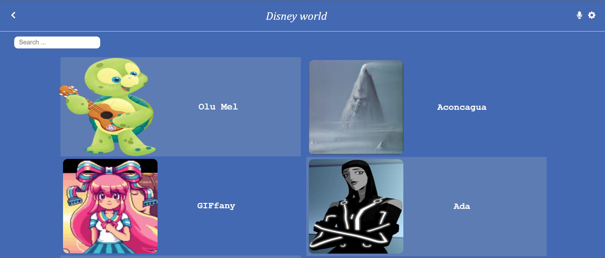
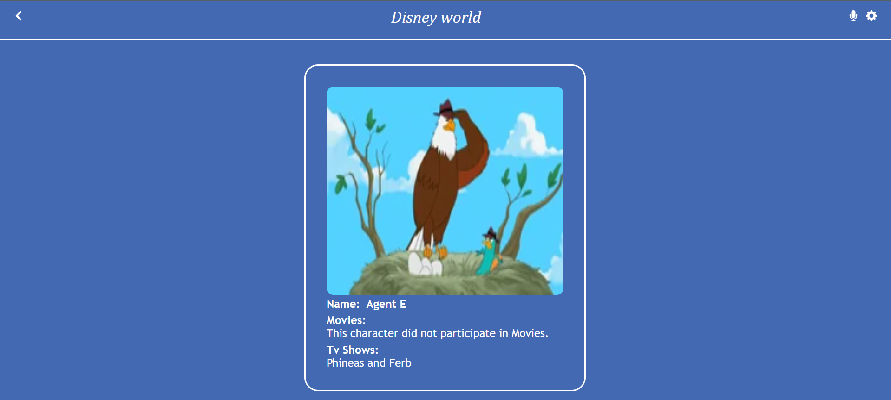
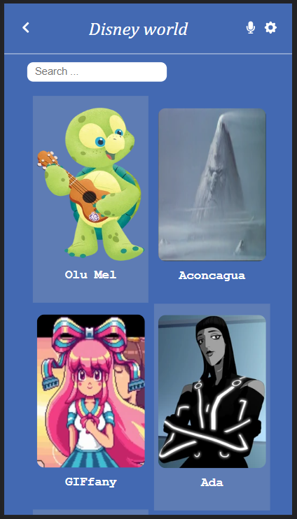
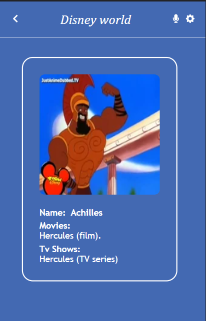

This is an info app about Disney characters, displays their names, images , movies names, etc,.  


## Disney-world.

### Screenshots.
##### Desktop:



##### mobile:




## Description:

> This is an info app about Disney characters, using disney API, displays their names, images , movies, and Tv Shows.

## Built With

- Css
- React
- Redux
- [Disney API](https://disneyapi.dev/).

## Live Demo

Please [click](https://disney-world.netlify.app/) for the live demo.

## Demo video:

Please [Click](https://www.loom.com/share/09d0ffbf633241738055946b211bf6e8) to watch the demo video.

## Getting Started

- Open your terminal, move to the directory where you want to clone the app (i.e cd Documents)
- Enter git clone https://github.com/ibr5500/Disney-world.git
- Change to the directory you just clone into (i.e cd Disney-world)
- Open index.html from the list of files in your left handside
- Right click on your opened index.html file and launch the live server to preview
- Include any possible changes and run "git add ."
- Commit the changes with a descriptive message (i.e xyz features added)
- Push the changes to changes to the repository (i.e git push)

### steps to run the project

#### 1 - Install npm.

```
npm install
```

#### 2 - run the project

```
npm start
```

To get a local copy up and running follow these simple example steps.

### Prerequisites

- HTML & CSS & JS
- npm
- node (latest version)

### Setup

- linters for CSS and JS
- Create react app
- install redux
- install react-redux

### Run tests

```
npm test
```

## Author

👤 **Ibrahim Ahmat**

- GitHub: [@ibr5500](https://github.com/ibr5500)
- Twitter: [@ibr_ahmat](https://twitter.com/ibr_ahmat)
- LinkedIn: [LinkedIn](https://www.linkedin.com/in/ibrahim-ahmat-b5513b1a6/)

## 🤝 Contributing

Feel free to check the [issues page](../../issues/).

## Show your support

### Please give a ⭐️ if you like this project!

## 📝 License

This project is [MIT](./MIT.md) licensed.
